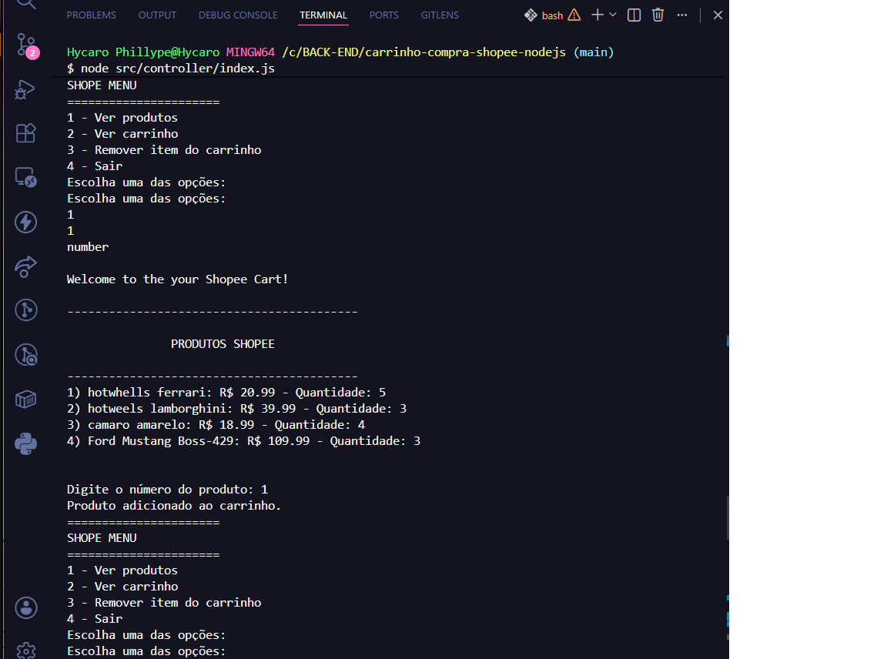

# 🛒 Shopee Cart - Node.js


Projeto desenvolvido durante o Bootcamp da **Digital Innovation One (DIO)** com o objetivo de praticar conceitos fundamentais de JavaScript e Node.js por meio da construção de um carrinho de compras inspirado na Shopee.

Durante o desenvolvimento, também implementei algumas melhorias além dos requisitos propostos, como controle de estoque, atualização automática das quantidades e sincronização entre carrinho e estoque.

---

## 🚀 Tecnologias utilizadas

- JavaScript (ES6+)
- Node.js
- Prompt Sync

---

## 📂 Estrutura do projeto

```
src
├── controller
│   └── index.js
└── services
    ├── cart.js
    ├── display.js
    └── item.js
```

---

## ⚙️ Funcionalidades

- ✅ Exibir menu interativo no terminal
- ✅ Listar produtos disponíveis
- ✅ Adicionar produtos ao carrinho
- ✅ Aumentar a quantidade de um item já existente
- ✅ Remover itens do carrinho
- ✅ Atualizar automaticamente o estoque
- ✅ Impedir a compra de produtos sem estoque
- ✅ Calcular subtotal de cada produto
- ✅ Calcular o valor total da compra

---

## ▶️ Como executar

Clone este repositório:

```bash
git clone https://github.com/SEU-USUARIO/SEU-REPOSITORIO.git
```

Entre na pasta:

```bash
cd carrinho-compra-shopee-nodejs
```

Instale as dependências:

```bash
npm install
```

Execute o projeto:

```bash
node src/controller/index.js
```

---

## 📖 Conceitos praticados

Durante o desenvolvimento deste projeto foram utilizados conceitos como:

- Modularização
- ES Modules
- Funções assíncronas
- Manipulação de Arrays
- findIndex()
- reduce()
- switch/case
- Estruturas de repetição
- Organização de código
- Separação de responsabilidades

---

## 💡 Melhorias implementadas

Além do desafio original, foram implementadas melhorias como:

- Controle de estoque em tempo real
- Atualização automática do estoque ao adicionar ou remover itens
- Validação de produto indisponível
- Incremento de quantidade quando o produto já existe no carrinho
- Organização do projeto em módulos

---

## 📚 Aprendizados

Durante este projeto pude praticar conceitos importantes de JavaScript e Node.js, como modularização, manipulação de arrays, controle de fluxo, organização de código e gerenciamento de estado entre carrinho e estoque. Além disso, implementei melhorias próprias para tornar o projeto mais completo e próximo de um cenário real.

## 📸 Demonstração



## 👨‍💻 Autor

Desenvolvido por **Hycaro Phillype** durante meus estudos em Desenvolvimento Backend.

GitHub: https://github.com/HycaroPhillype

LinkedIn: https://www.linkedin.com/in/hycarophillype/
